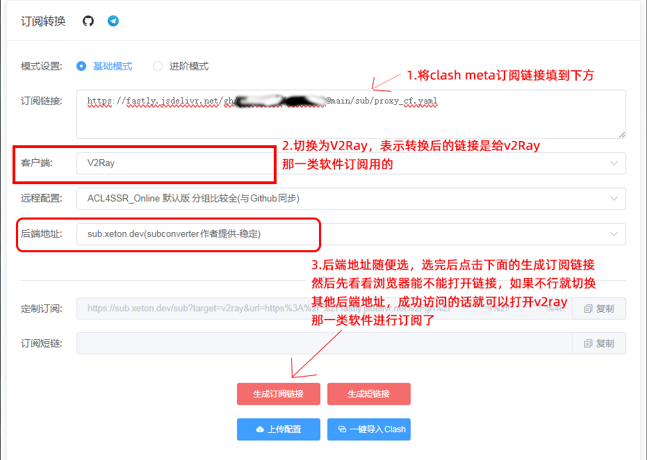

# 记录一些安卓软件

### 系统工具
[甲壳虫ADB助手](https://github.com/didjdk/adbhelper)
- 闭源免费软件
- 用于在局域网内连接电视adb后，给电视安装软件，比较方便，不用搞个U盘去装。
- [adbhelper_v1.3.1.apk 下载](https://github.com/didjdk/adbhelper/releases/download/v1.3.1/adbhelper_v1.3.1.apk)
- [adbhelper_v1.3.1.apk 加速下载](https://ghproxy.cc/https://github.com/didjdk/adbhelper/releases/download/v1.3.1/adbhelper_v1.3.1.apk)

文件传输类工具下载
- 说明：手机开热点启动http服务器提供给连接热点的设备访问手机的文件进行上传和下载，或者手机与其他设备连接同一个wifi也可以，总之就是同一个局域网文件传输
- [HTTP File Server (WebDAV)_1.5.5_汉化完整版.apk](https://ghproxy.cc/https://raw.githubusercontent.com/zhixc/files/master/apk/HTTP%20File%20Server_WebDAV_1.5.5_cn.apk)
- [HTTP File Server by slowscript v1.5.8_英文.apk](https://ghproxy.cc/https://raw.githubusercontent.com/zhixc/files/master/apk/HTTP%20File%20Server%20by%20slowscript_v1.5.8_en.apk)

---
### 阅读工具

[阅读](https://github.com/gedoor/legado)
- 非常强大支持自定义书源的阅读软件，支持 txt 格式小说、epub
- 建议下载Beta版的，功能多且新
- [阅读 源仓库](https://www.yckceo.com/)
  - 推荐，有精选的源，选择几十个的那种就好，多了没意义
  - 超过100个，搜索等半天，很多还是垃圾站。
- [猫公子](https://dy.mgz6.com/)
  - 订阅源：[yuedu://rsssource/importonline?src=http://yuedu.miaogongzi.net/shuyuan/miaogongziDY.json](yuedu://rsssource/importonline?src=http://yuedu.miaogongzi.net/shuyuan/miaogongziDY.json)

---

### 主机/掌机/街机模拟工具

[PPSSPP](https://www.ppsspp.org)
- 开源高效率的 PSP 模拟器，世界上最好的 PSP 模拟器。支持安卓、IOS、MacOS、Windows系统
- v1.17.1
  - [下载](https://www.ppsspp.org/files/1_17_1/ppsspp.apk)
- v1.18.1
  - [下载](https://www.ppsspp.org/files/1_18_1/ppsspp.apk)

AetherSX2 免费的安卓端 PS2 模拟器，高效率模拟 PS2 游戏。目前作者已经停止更新。可惜了。要求安卓 8.0 以上 64 位设备才能运行。
- [Aethersx2 Emulator For Android / IOS / Windows / Linux / Mac](https://aethersx2.gitlab.io)

天马G整合包
- [安卓+PC天马3.5 正式版 复古模拟器 何浩的个人网站](https://haohe.fun/2022/07/%E5%AE%89%E5%8D%93pc%E5%A4%A9%E9%A9%AC3-5-%E6%AD%A3%E5%BC%8F%E7%89%88-%E5%A4%8D%E5%8F%A4%E6%A8%A1%E6%8B%9F%E5%99%A8/)
- [天马G洗版级更新 - 经典游戏怀旧专区 - TGFC Lifestyle](https://bbs.tgfcer.com/viewthread.php?tid=8359222&extra=&page=1)

---

### 代理工具
[FlClash](https://github.com/chen08209/FlClash)
- 支持 yml / yaml 等订阅
- v0.8.81，要求 安卓 5.0 以上，macOS 10.14 可用，win10 可用，[发布地址](https://github.com/chen08209/FlClash/releases/tag/v0.8.81)
  - [安卓版 FlClash-0.8.81-android-armeabi-v7a.apk 下载](https://github.com/chen08209/FlClash/releases/download/v0.8.81/FlClash-0.8.81-android-armeabi-v7a.apk)
  - [安卓版 FlClash-0.8.81-android-armeabi-v7a.apk 加速下载](https://ghproxy.cc/https://github.com/chen08209/FlClash/releases/download/v0.8.81/FlClash-0.8.81-android-armeabi-v7a.apk)
  - [安卓版 FlClash-0.8.81-android-arm64-v8a.apk 下载](https://github.com/chen08209/FlClash/releases/download/v0.8.81/FlClash-0.8.81-android-arm64-v8a.apk)
  - [安卓版 FlClash-0.8.81-android-arm64-v8a.apk 加速下载](https://ghproxy.cc/https://github.com/chen08209/FlClash/releases/download/v0.8.81/FlClash-0.8.81-android-arm64-v8a.apk)
  - [macOS版 intel cpu 版 FlClash-0.8.81-macos-amd64.dmg 下载](https://github.com/chen08209/FlClash/releases/download/v0.8.81/FlClash-0.8.81-macos-amd64.dmg)
  - [macOS版 intel cpu 版 FlClash-0.8.81-macos-amd64.dmg 加速下载](https://ghproxy.cc/https://github.com/chen08209/FlClash/releases/download/v0.8.81/FlClash-0.8.81-macos-amd64.dmg)
  - [macOS版 M 芯片 arm 架构版 FlClash-0.8.81-macos-arm64.dmg 下载](https://github.com/chen08209/FlClash/releases/download/v0.8.81/FlClash-0.8.81-macos-arm64.dmg)
  - [macOS版 M 芯片 arm 架构版 FlClash-0.8.81-macos-arm64.dmg 加速下载](https://ghproxy.cc/https://github.com/chen08209/FlClash/releases/download/v0.8.81/FlClash-0.8.81-macos-arm64.dmg)
  - [windows版 FlClash-0.8.81-windows-amd64-setup.exe 下载](https://github.com/chen08209/FlClash/releases/download/v0.8.81/FlClash-0.8.81-windows-amd64-setup.exe)
  - [windows版 FlClash-0.8.81-windows-amd64-setup.exe 加速下载](https://ghproxy.cc/https://github.com/chen08209/FlClash/releases/download/v0.8.81/FlClash-0.8.81-windows-amd64-setup.exe)
  - [windows版 FlClash-0.8.81-windows-amd64.zip 下载](https://github.com/chen08209/FlClash/releases/download/v0.8.81/FlClash-0.8.81-windows-amd64.zip)
  - [windows版 FlClash-0.8.81-windows-amd64.zip 加速下载](https://ghproxy.cc/https://github.com/chen08209/FlClash/releases/download/v0.8.81/FlClash-0.8.81-windows-amd64.zip)

遇到无法导入的 yaml 文件时或导入后启动异常，可以尝试用订阅转换将 yaml 订阅转成 V2ray 订阅，订阅转换网站：[https://acl4ssr-sub.github.io/](https://acl4ssr-sub.github.io/)

订阅转换参考：

[ClashMetaForAndroid](https://github.com/MetaCubeX/ClashMetaForAndroid)
- 支持 yml / yaml 等订阅
- 安卓 5.0 以上，v2.11.7
  - [cmfa-2.11.7-meta-armeabi-v7a-release.apk 下载](https://github.com/MetaCubeX/ClashMetaForAndroid/releases/download/v2.11.7/cmfa-2.11.7-meta-armeabi-v7a-release.apk)
  - [cmfa-2.11.7-meta-armeabi-v7a-release.apk 加速下载](https://ghproxy.cc/https://github.com/MetaCubeX/ClashMetaForAndroid/releases/download/v2.11.7/cmfa-2.11.7-meta-armeabi-v7a-release.apk)
  - [cmfa-2.11.7-meta-arm64-v8a-release.apk 下载](https://github.com/MetaCubeX/ClashMetaForAndroid/releases/download/v2.11.7/cmfa-2.11.7-meta-arm64-v8a-release.apk)
  - [cmfa-2.11.7-meta-arm64-v8a-release.apk 加速下载](https://ghproxy.cc/https://github.com/MetaCubeX/ClashMetaForAndroid/releases/download/v2.11.7/cmfa-2.11.7-meta-arm64-v8a-release.apk)

---

### 下载工具

[1DM+](https://www.yxssp.com/23740.html)
- 这个软件支持多线程下载，可以嗅探网页的 m3u8 视频，然后下载合并转码成 mp4
- [蓝奏盘下载，密码：cajd](https://yxssp.lanzoui.com/b478866)

[Android 安卓 迅雷v8.14 去广告解锁限速无限速版 – 小兵下载站](https://www.7xiazai.com/xunlei)

[迅雷APP(手机迅雷不限速) v8.03.0.9067 -绿软小站](https://www.gndown.com/5107.html)

---

### 影音播放
TVBox
- 由猫影视作者联合其他大佬搞的初代，已经删库
- 目前仍存在且好用的是俊哥的版本：[q215613905/TVBoxOS](https://github.com/q215613905/TVBoxOS)
  - [20230902](https://github.com/o0HalfLife0o/TVBoxOSC/releases/tag/20230902-0114)
  - [打包好的安装包apk发布地址](https://github.com/o0HalfLife0o/TVBoxOSC/releases/tag/20250410-1602)
- 基于初代、俊哥版代码修改的个人自用版本，安卓4.1以上可安装：[zhixc/TVBoxOSC](https://github.com/zhixc/TVBoxOSC)
  - [个人自用版下载](https://ghproxy.cc/https://raw.githubusercontent.com/zhixc/files/master/apk/TVBoxOSC_v1.0.0_kai.apk)

[FongMi影视TV](https://github.com/FongMi/TV)

收录了一些历史版本源码的仓库：[chengxue2020/BearTV](https://github.com/chengxue2020/BearTV)
- 参考的改动透明背景(可以逆着改回白色背景，还是FongMi原版的好看)：

  [pull 255](https://github.com/FongMi/TV/pull/255/) 

  [pull 254](https://github.com/FongMi/TV/pull/254/)

TVBox / FongMi TV 搭配的接口资源
- 配置编辑器：[https://zhixc.github.io/CatVodTVJsonEditor](https://zhixc.github.io/CatVodTVJsonEditor)

- 自用接口配置：
  - [https://ghproxy.cc/https://raw.githubusercontent.com/zhixc/CatVodTVSpider/main/config.json](https://ghproxy.cc/https://raw.githubusercontent.com/zhixc/CatVodTVSpider/main/config.json)

- [ls125781003/tvboxtg](https://github.com/ls125781003/tvboxtg)
  - [https://ghproxy.net/https://raw.githubusercontent.com/ls125781003/tvboxtg/main/欧歌/api.json](https://ghproxy.net/https://raw.githubusercontent.com/ls125781003/tvboxtg/main/欧歌/api.json)

- [https://gitlab.com/ylede1/tvbox/-/blob/master/DC.json](https://gitlab.com/ylede1/tvbox/-/blob/master/DC.json)

- [https://git.acwing.com/cuijw/cjwbox](https://git.acwing.com/cuijw/cjwbox)

